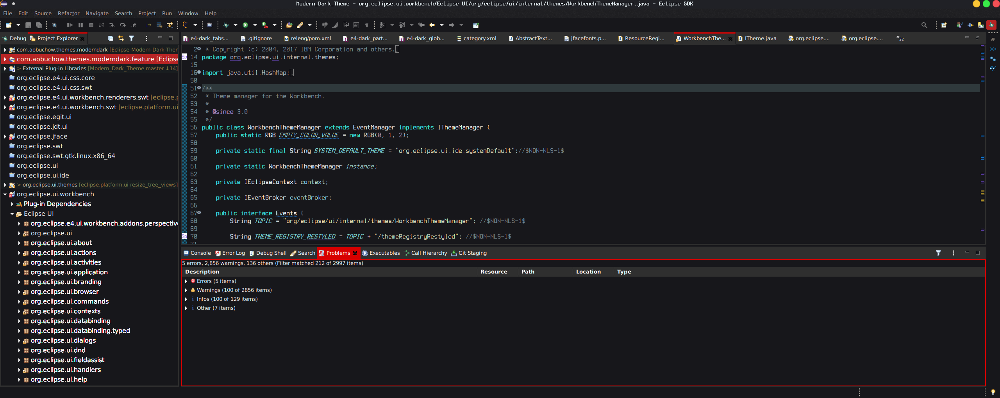
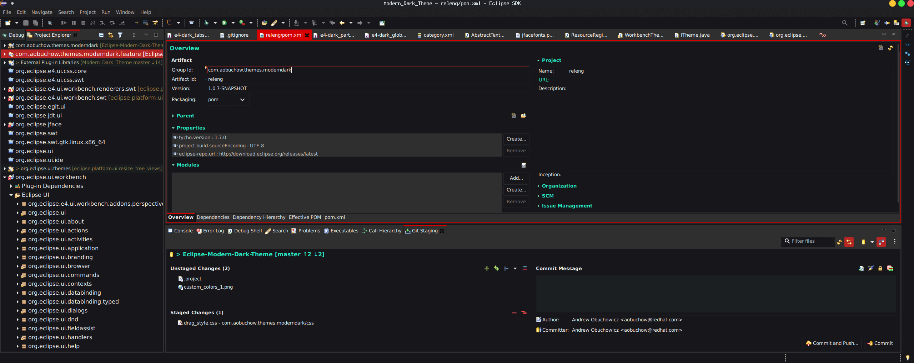
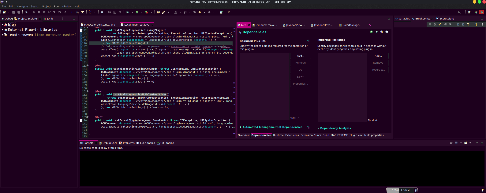
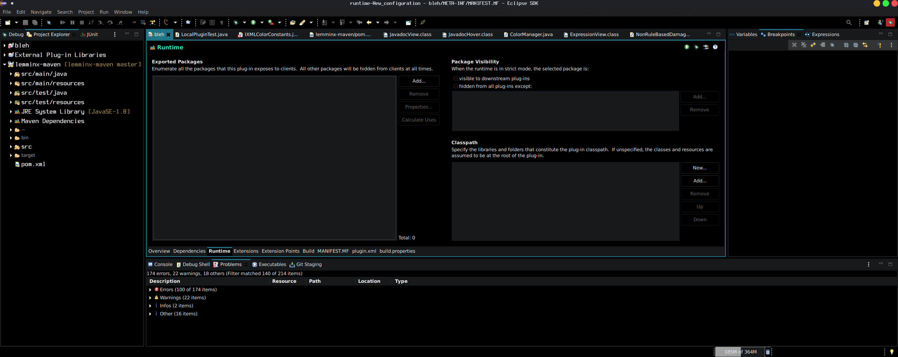
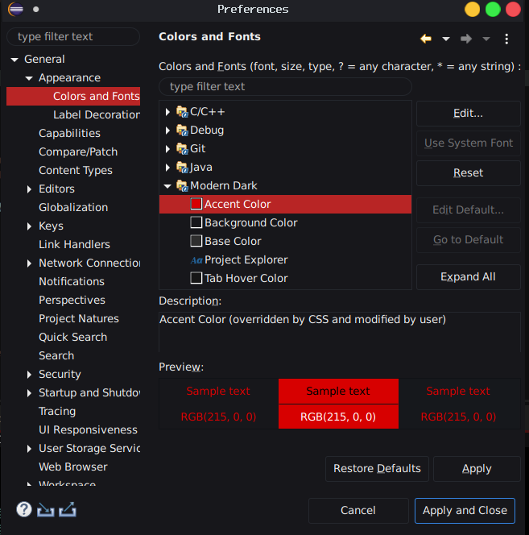

# Eclipse Modern Dark Theme

This plugin adds the _Modern Dark_ theme to Eclipse IDE.

## Features

- Gives Eclipse a clean visual overhaul

- Allows Eclipse's Project Explorer font to be set.

- Provides customization options for the colors used in the theme 

## How it looks

**Note:** The above screenshots were taken on Linux using with [Abrus-dark](https://github.com/vinceliuice/Abrus-gtk-theme) GTK theme.

### Color customization examples

#### How to customize the theme's color & font preferences

Open Eclipse's preferences and navigate to General -> Appearance -> Colors and Fonts. The plugin's color & font preferences are under the Modern Dark category folder.

## Plugin Installation

### Update Site

`https://raw.githubusercontent.com/AObuchow/Eclipse-Modern-Dark-Theme/updatesite/updatesite/`
